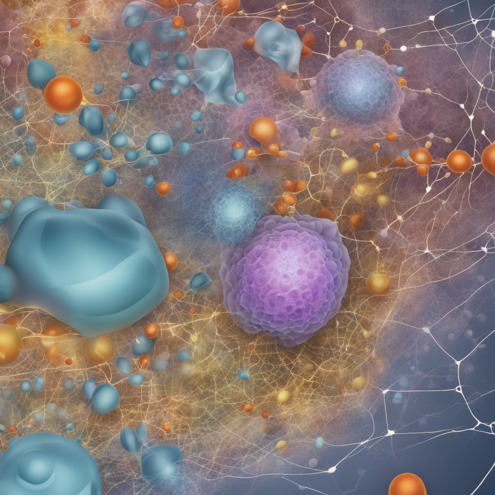

# EDA for HPA Single Cell Classification

Welcome to the "EDA for HPA Single Cell Classification" repository! 🧬🔍

If you're passionate about data science and ready to embark on an exciting journey into the realm of single-cell classification in the Human Protein Atlas (HPA) dataset, you're in the right place! This repository is designed to not only provide you with a comprehensive exploratory data analysis (EDA) of the dataset but also to help you showcase your skills as a fresher in the world of data science. 🌟

## About the Project

The Human Protein Atlas is a treasure trove of biological insights waiting to be uncovered. This project is your opportunity to dive deep into the intricacies of single-cell classification, where data analysis meets the world of biology. Through this repository, you'll gain hands-on experience in:

- Understanding the dataset's structure and composition
- Visualizing cell types and their distributions
- Identifying potential challenges and patterns
- Creating insightful data visualizations
- Presenting your findings in a visually appealing manner

## Getting Started

1. **Clone the Repository**: Start by cloning this repository to your local machine using the following command:
   ```
   git clone https://github.com/your-username/EDA-For-HPA-Single-Cell-Classification.git
   ```

2. **Install Dependencies**: Navigate to the repository's directory and install any necessary dependencies by running:
   ```
   pip install -r requirements.txt
   ```

3. **Explore the Notebooks**: Dive into the `notebooks` directory to find a collection of Jupyter notebooks. These notebooks guide you through the EDA process step-by-step, providing explanations and code snippets along the way.

4. **Visualize Your Insights**: Use the code and techniques provided to create engaging visualizations that highlight the key findings from your analysis. Feel free to customize and experiment with different visualization libraries and styles.

5. **Update the Cover Image**: The repository's cover image is your chance to impress! Create an eye-catching image that reflects your journey through the data, combining elements of data analysis, cellular biology, and discovery.

6. **Update the README**: As you progress, don't forget to update this README with your own experiences, challenges overcome, and insights gained. This serves as a showcase of your ability to communicate and present your work.

## Contributing

If you're inspired by this project and want to contribute, we welcome your input! Whether it's optimizing the code, suggesting new visualizations, or enhancing the documentation, your contributions are valuable to the data science community.

## Showcase Your Skills

As a fresher in the data science field, this repository isn't just about analyzing data. It's about telling a story, showcasing your skills, and demonstrating your ability to make sense of complex datasets. Let your passion for data science shine through as you unravel the mysteries hidden within the HPA dataset.

Happy coding and exploring! 🚀🔬

---
